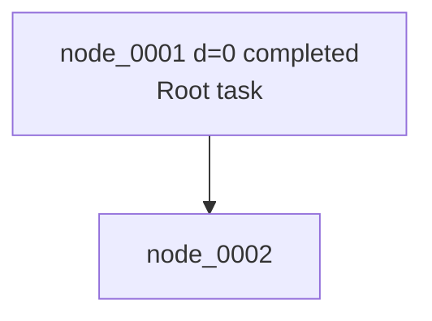

# Recursive Agent Harness

This project implements a RAO-style recursive agent inference harness. It reproduces the inference-time execution scaffold described in Recursive Agent Optimization: one root agent can dynamically launch sub-agents, sub-agents use the same policy wrapper, and the rollout is recorded as a recursive execution tree.

This project does not implement RAO training. It does not compute Eq.3 leave-one-out advantages, Eq.5 policy optimization, policy gradients, reward model training, or parameter updates.

## What It Implements

- Shared policy across root and sub-agents.
- Dynamic recursive execution tree generated by policy actions at runtime.
- `async launch_subagent(...)` and parallel child execution with `asyncio.gather`.
- Bounded execution with depth, step, child, total node, timeout, tool-call, and parallel-child limits.
- Structured JSON actions instead of free-form control text.
- Full trace logging for nodes, actions, observations, child results, status, timing, and errors.
- JSON trace export, pretty text tree, and Mermaid graph export.
- Training extension placeholders such as node-level `success_signal`, `reward`, rollout metadata, and batch manifests.

## Install

Use Python 3.10+; Python 3.11 or newer is recommended.

```bash
python3 -m pip install -r requirements.txt
```

Install test dependencies separately when running the suite:

```bash
python3 -m pip install -r tests/requirements.txt
```

The core runtime depends on Pydantic. Tests use pytest and pytest-asyncio.

## Run The API Example

The example uses `LLMPolicy` with the OpenAI-compatible API client. API settings are loaded from `config.yaml`; the runtime does not read OpenAI API settings from environment variables.

Edit `config.yaml`:

```yaml
model_name: "gpt-4.1-mini"
base_url: "https://api.openai.com/v1"
api_key: "YOUR_OPENAI_API_KEY"
```

Then run:

```bash
python3 examples/run_recursive_agent.py
```

You can also pass a different YAML file:

```bash
python3 examples/run_recursive_agent.py --config path/to/config.yaml
```

Without a real `api_key` in YAML, the script exits with a configuration error rather than falling back to a rule-based policy.

```bash
python3 examples/run_recursive_agent.py
```

It runs this task:

```text
Plan a 3-day Kyoto trip in early April for a family. We want cherry blossoms, one quiet temple, one kid-friendly activity, and dinner near Gion. Avoid overly crowded spots.
```

Expected outputs:

- final answer printed to stdout;
- pretty execution tree printed to stdout;
- `trace.json`;
- `trace.mmd`.

## Use LLMPolicy

`LLMPolicy` uses an OpenAI-compatible Chat Completions client. Configure:

- `model_name`;
- `base_url`;
- `api_key`;
- `temperature`;
- `max_tokens`.

The harness remains provider-agnostic: `RecursiveAgent` depends only on the `Policy` interface, not on a specific model provider.

`LLMPolicy` behavior:

- renders `AgentState` into a system prompt and state prompt;
- requests exactly one strict JSON `AgentAction`;
- parses the result with Pydantic;
- attempts one JSON repair call after parse failure;
- falls back to a structured `FINISH` action if repair fails;
- records raw response and parse errors in action metadata for trace logging.

## Trace Files

`trace.json` stores the complete recursive rollout tree:

- `run_id`;
- `root_node_id`;
- redacted config snapshot;
- node map;
- node trajectory;
- final answer;
- error;
- timing metadata;
- future training placeholders.

`trace.mmd` stores a Mermaid graph:



## LLM Evaluation

The harness includes an `LLMJudge` for evaluating root tasks and sub-tasks with OpenAI-compatible chat completions. The judge prompts follow the DeepDive root-task and sub-task judge structure:

- root evaluation compares the agent answer with a ground-truth answer;
- sub-task evaluation also checks whether delegation was useful, concrete, non-overlapping, and efficient;
- results are returned as strict JSON with `reason` and `success`;
- `evaluate_tree(...)` can write `llm_judge` and `success_signal` back into node metadata.

Example:

```python
from recursive_agent_harness.evaluator import LLMJudge

judge = LLMJudge(config=config)
results = await judge.evaluate_tree(
    tree,
    ground_truth_by_node={
        "node_0001": "ground truth for root",
        "node_0002": "ground truth for a sub-task",
    },
)
```

## Tests

Run the full suite:

```bash
python3 -m pytest -q
```

The tests do not require network access or a real LLM. They cover:

- action/config/state schemas;
- execution tree export;
- tool registry behavior;
- depth limit;
- total node limit;
- max children and parallel children;
- timeout;
- invalid action fallback;
- shared policy identity;
- LLMPolicy parse, repair, and fallback;
- batch rollout manifest.

## Design Principles

- Harness executes, policy decides.
- Recursion is dynamic, not hard-coded.
- Root and sub-agents share the same policy wrapper.
- Each node is a full agent instance.
- Each edge is a delegated sub-task.
- Recursive execution is bounded.
- Actions are structured JSON.
- Trace everything.
- Failure is data, not crash.
- API-backed policy by default; deterministic policies are limited to tests.
- Training hooks are reserved but not implemented.
