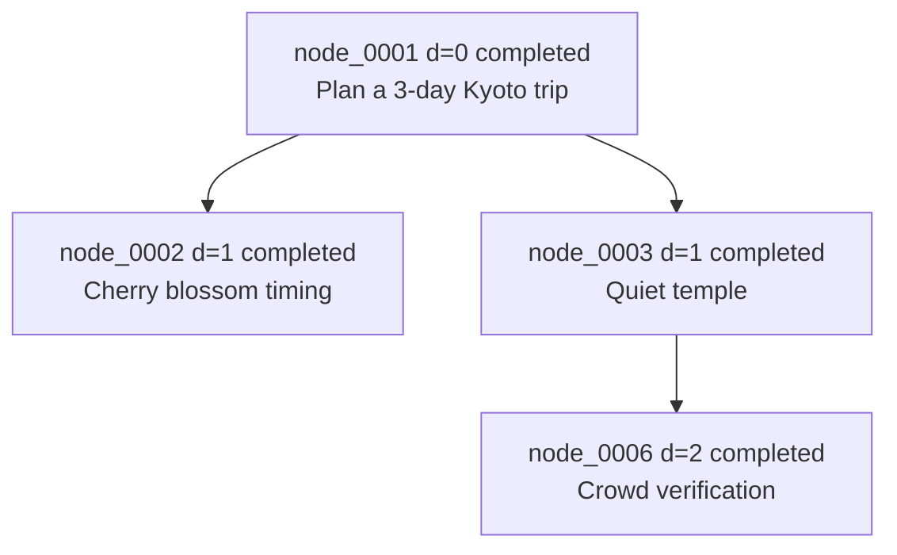

# 1. 项目定位

本项目要复现的是 Recursive Agent Optimization (RAO) 论文中的 **recursive agent inference harness**，也就是递归 agent 的推理期执行框架，而不是 RAO 的训练算法。

项目核心目标是实现一个可运行、可追踪、可扩展的 recursive rollout harness：

- root agent 接收用户原始任务；
- agent 在执行过程中可以通过 `async launch_subagent(...)` 动态委派子任务；
- child agent 是同一个 policy wrapper 的新实例；
- child agent 可以继续递归委派自己的子任务；
- 整个执行过程形成动态生成的 recursive execution tree；
- 每个 node 对应一个完整 agent instance；
- 每条 edge 对应一次 delegated sub-task；
- 所有节点共享同一个 policy 抽象；
- harness 负责边界控制、异步执行、trace 记录和结果聚合接口；
- policy 负责决定是否直接回答、调用工具、委派子 agent、并行委派或结束。

## Inference harness 与 training objective 的边界

本项目实现：

- recursive rollout tree 的生成与执行；
- shared policy 在 root 和所有 sub-agent 上的复用；
- dynamic recursive execution tree；
- `async launch_subagent` 和并行 `asyncio.gather`；
- `max_depth`、`max_steps_per_node`、`max_children_per_node`、`total_node_limit`、`timeout_seconds` 等边界控制；
- 每个节点的 trajectory、children、status、error、start/end time、final answer 等 trace；
- JSON trace、pretty text tree、Mermaid graph 导出；
- 为未来接入 reward / training 保留字段和导出格式。

本项目不实现：

- RAO training；
- Eq.3 leave-one-out advantage；
- Eq.5 policy optimization；
- 梯度更新、critic、rollout group 采样或权重更新；
- 真实 node-level reward evaluator 的训练逻辑。

但是 trace 结构需要为未来训练扩展保留接口：

- node-level `success_signal` 字段；
- node-local `reward` 字段；
- `parent_id`、`depth`、`children_ids`、`trajectory` 等可重建 rollout tree 的字段；
- raw policy action 和 observation；
- root rollout id / batch id 预留 metadata；
- future training export hook。

项目原则是：**先复现 recursive inference harness，后续再接 RAO training hooks。**

# 2. 技术选型建议

## 2.1 Python 版本

建议使用 **Python 3.10+**，优先推荐 **Python 3.11**。

理由：

- `asyncio` 在 Python 3.10+ 中已经足够成熟，能够自然表达 recursive agent 的异步子任务委派；
- Python 3.11 的异常组、任务调度性能和 async 调试体验更好；
- 类型注解、`dataclass`、`typing.Protocol`、`Literal`、`Annotated` 等能力适合构建清晰的 harness 抽象；
- pytest、pytest-asyncio、Pydantic、OpenAI-compatible client 等生态兼容性强；
- 本地 demo、单元测试和后续扩展到真实 LLM provider 都比较直接。

最低版本建议：

```text
python >= 3.10
recommended: python 3.11
```

## 2.2 数据结构建模

需要同时使用 `dataclass` 和 Pydantic，但职责不同。

### dataclass

适合内部 runtime 状态：

- `RecursiveAgent` 的内部字段；
- runtime-only budget object；
- in-memory child references；
- tool execution context；
- 不需要直接暴露给 LLM 的轻量内部结构。

优点：

- 标准库内置；
- 创建和访问成本低；
- 适合 Python 内部对象；
- 不强制 JSON schema，便于保存 runtime references。

局限：

- 对 LLM 输出 JSON 的校验不够强；
- 错误恢复、字段默认值、枚举约束需要手写；
- 导出 schema 不方便。

### Pydantic

适合外部 schema 和可序列化结构：

- `AgentAction`；
- `SubtaskSpec`；
- `AgentState`；
- `NodeResult`；
- `TrajectoryStep`；
- `HarnessConfig`；
- `TraceNode`；
- `ExecutionTrace`；
- LLM structured output schema。

优点：

- 能提供 JSON schema 给 LLM；
- 字段校验、默认值、枚举约束清晰；
- 对 LLM 输出解析失败时能得到结构化错误；
- 方便做 repair prompt；
- 方便 trace JSON 导出；
- 方便后续接入 API、CLI 或可视化前端。

最终建议：

- 内部 runtime 结构可以使用 `dataclass`；
- LLM action / state / config / trace schema 建议使用 Pydantic；
- 原因是 LLM 输出必须进行 JSON schema 校验、字段默认值补全、错误恢复和可序列化 trace。

## 2.3 异步框架

建议使用原生 **asyncio**，不在第一版引入 Celery、Ray 或 multiprocessing。

理由：

- RAO-style harness 的核心开销主要来自 I/O-bound LLM/tool call；
- `async launch_subagent(...)` 可以直接映射到 `asyncio.create_task`；
- 并行子任务可以直接使用 `asyncio.gather`；
- 本地 demo 和单元测试更简单；
- 不需要引入任务队列、worker、序列化边界或分布式调度；
- 更容易保证 deterministic trace 和 budget accounting。

第一版执行模型：

- 单进程；
- 单 event loop；
- child agent 使用 coroutine 执行；
- parallel child agents 使用 `asyncio.gather`；
- timeout 使用 `asyncio.wait_for`；
- cancellation 通过 task cancellation 传播；
- global budget 使用共享 budget object 控制。

未来如果需要大规模分布式执行，可以提前抽象：

```text
Runner / Executor interface
  - LocalAsyncExecutor
  - RayExecutor
  - RemoteQueueExecutor
```

这样第一版不绑定 Ray，但后续可以替换 executor 层。

## 2.4 LLM 接入

建议实现 **OpenAI-compatible client wrapper**，而不是绑定某个具体 provider。

第一版需要支持：

- OpenAI API；
- 通过 `base_url` 兼容 OpenAI-compatible provider；
- `api_key` 从配置或环境变量读取；
- `model_name`、`temperature`、`max_tokens` 可配置；
- chat completion；
- strict JSON output 解析；
- raw response 记录；
- parse error 记录；
- 一次 JSON repair；
- repair 失败后的 fallback。

设计原则：

- harness 不应该依赖具体模型 provider；
- `LLMPolicy` 依赖一个 `ChatClient` 抽象；
- `ChatClient` 负责 API 调用；
- `LLMPolicy` 负责 prompt 渲染、JSON schema 约束、解析、repair 和 fallback；
- `RecursiveAgent` 不知道底层是 OpenAI、兼容 provider、mock policy 还是 rule-based policy。

建议接口：

```text
ChatClient.complete(messages, model, temperature, max_tokens) -> ChatCompletionResult
```

未来可以加入：

- retry / backoff；
- rate limit；
- streaming；
- tool-use provider adapter；
- structured output API；
- multi-model policy routing。

## 2.5 配置管理

建议使用 **YAML + Pydantic Settings**，或在最小版本中先使用简单 Pydantic config。

需要包含的配置项：

```yaml
max_depth: 3
max_steps_per_node: 12
max_children_per_node: 6
total_node_limit: 32
timeout_seconds: 120
invalid_action_limit: 2
max_tool_calls_per_node: 6
max_parallel_children: 4

model_name: "gpt-4.1-mini"
base_url: "https://api.openai.com/v1"
api_key: "${OPENAI_API_KEY}"
temperature: 0.2
max_tokens: 1200

trace_output_path: "trace.json"
mermaid_output_path: "trace.mmd"
log_level: "INFO"
```

配置职责：

- `config.py` 定义 `HarnessConfig`；
- 支持默认值；
- 支持从 YAML 读取；
- 支持环境变量覆盖敏感字段；
- 运行时传入 `Runner`；
- `Runner` 将必要配置传入 root agent 和 global budget。

## 2.6 日志与 trace

建议：

- runtime logging 使用 Python `logging`；
- structured trace 使用 JSON；
- tree visualization 支持 pretty text 和 Mermaid；
- 每个 node 记录完整 execution metadata。

日志和 trace 分工：

- logging：给开发者实时观察运行状态，例如 node start、action type、tool call、child failure、timeout；
- trace：给测试、复盘、可视化和未来训练使用，必须结构化、可重放、可导出。

每个 node trace 至少包含：

```json
{
  "node_id": "node_0001",
  "parent_id": null,
  "depth": 0,
  "task": "...",
  "status": "completed",
  "children_ids": ["node_0002", "node_0003"],
  "trajectory": [],
  "final_answer": "...",
  "error": null,
  "start_time": "2026-06-04T11:00:00Z",
  "end_time": "2026-06-04T11:00:12Z",
  "metadata": {
    "expected_output": "...",
    "constraints": {},
    "success_signal": null,
    "reward": null
  }
}
```

可视化导出：

- `export_json(path)`：完整 trace；
- `pretty_print()`：终端可读树；
- `export_mermaid(path)`：Mermaid graph；
- Mermaid 节点 label 包含 depth、node_id、status 和 task 摘要。

## 2.7 测试框架

建议使用：

```text
pytest
pytest-asyncio
```

必须测试：

- depth limit；
- total node limit；
- parallel subagent execution；
- invalid action fallback；
- trace export；
- shared policy identity；
- RuleBasedPolicy demo 行为。

测试原则：

- harness 行为用 deterministic policy 测试；
- 不依赖真实 LLM；
- 不依赖网络；
- async 测试使用 `pytest.mark.asyncio`；
- 每个边界条件有独立测试；
- trace JSON 应验证关键字段，而不是只检查文件存在。

# 3. 总体架构

建议项目结构如下：

```text
recursive_agent_harness/
    __init__.py
    agent.py
    policy.py
    actions.py
    state.py
    tools.py
    tree.py
    prompts.py
    config.py
    runner.py
    errors.py

examples/
    run_recursive_agent.py

tests/
    test_tree.py
    test_rule_based_policy.py
    test_depth_limit.py
    test_parallel_subagents.py
    test_invalid_action.py
    test_shared_policy.py

README.md
plan.md
```

说明：`design.md` 中写的是 `init.py`，实际 Python package 入口应使用 `__init__.py`。如果必须完全保留设计文档命名，也可以额外说明 `init.py` 是误写，工程实现应采用标准 `__init__.py`。

## 文件职责

### `recursive_agent_harness/__init__.py`

包入口，导出主要公共 API：

- `RecursiveAgent`；
- `Runner`；
- `HarnessConfig`；
- `Policy`；
- `RuleBasedPolicy`；
- `LLMPolicy`；
- `AgentAction`；
- `ExecutionTree`。

该文件不放复杂逻辑。

### `recursive_agent_harness/agent.py`

定义 `RecursiveAgent`。

职责：

- 执行 policy 产生的 `AgentAction`；
- 维护当前 node 的 trajectory；
- 构造 `AgentState`；
- 调用工具；
- 启动单个 child agent；
- 并行启动多个 child agents；
- 处理 step limit、depth limit、child failure、fallback finish；
- 将 action、observation、error、final answer 写入 tree trace。

重要边界：

- `agent.py` 只负责执行 action；
- `agent.py` 不负责决定如何拆任务；
- `RecursiveAgent.run()` 中不能硬编码 Kyoto travel task 或任何特定任务拆分逻辑；
- 任务拆分只能来自 `Policy.act(...)` 的输出。

### `recursive_agent_harness/policy.py`

定义 policy 抽象和实现：

- `Policy` 抽象接口；
- `RuleBasedPolicy` 本地 demo；
- `LLMPolicy` 真实模型调用；
- 可选 `InvalidActionPolicy`、`StaticPolicy` 供测试使用。

职责：

- 根据 `AgentState` 生成下一步 `AgentAction`；
- RuleBasedPolicy 内部可包含 demo-specific 规则；
- LLMPolicy 负责 prompt 渲染、chat completion、JSON 解析、repair、fallback。

重要边界：

- shared policy 通过同一个 policy object 或同一个 policy wrapper 传入所有 agent；
- child agent 不创建不同策略；
- harness 不知道 policy 内部如何决策。

### `recursive_agent_harness/actions.py`

定义结构化 action schema。

职责：

- `ActionType`；
- `SubtaskSpec`；
- `ToolCallPayload`；
- `AgentAction`；
- 针对不同 action type 的字段约束；
- Pydantic JSON schema；
- action validation helper。

应支持 action 类型：

- `THINK`；
- `TOOL_CALL`；
- `DIRECT_ANSWER`；
- `LAUNCH_SUBAGENT`；
- `LAUNCH_SUBAGENTS_PARALLEL`；
- `AGGREGATE`；
- `FINISH`。

### `recursive_agent_harness/state.py`

定义 agent runtime state 和结果 schema。

职责：

- `AgentState`；
- `NodeResult`；
- `TrajectoryStep`；
- `ChildSummary`；
- `NodeStatus`；
- 可序列化的 state rendering 输入结构。

重要边界：

- `AgentState` 不包含完整全局历史；
- 只包含当前 node 必要上下文、压缩 trajectory、child summaries、available tools 和全局树摘要；
- 避免上下文膨胀。

### `recursive_agent_harness/tools.py`

定义工具注册与执行。

职责：

- `Tool` schema；
- `ToolRegistry`；
- `register_tool`；
- `call(tool_name, arguments)`；
- 参数校验；
- 工具异常捕获；
- mock search、calculator、read_text、optional python_exec 等工具扩展点。

重要边界：

- tool execution 返回结构化 observation；
- tool failure 不直接导致整个 node 崩溃，除非是不可恢复系统错误；
- tool call 数量受 `max_tool_calls_per_node` 限制。

### `recursive_agent_harness/tree.py`

定义 execution tree 和 trace logger。

职责：

- `ExecutionTree`；
- `TraceLogger`；
- `TraceNode`；
- `register_node`；
- `update_node_status`；
- `append_action`；
- `append_observation`；
- `attach_child`；
- `export_json`；
- `pretty_print`；
- `export_mermaid`。

重要边界：

- tree 只记录结构和事件；
- tree 不决定 policy；
- tree 不执行 agent；
- tree 为未来 reward / training 提供可序列化数据。

### `recursive_agent_harness/prompts.py`

保存 LLMPolicy 的 prompt 和 state rendering。

职责：

- system prompt；
- user/state prompt template；
- action schema prompt；
- JSON repair prompt；
- `render_state(state)`；
- `render_available_actions(state)`；
- `render_child_summaries(state)`。

重要边界：

- prompt 明确当前模型是 recursive execution tree 中的一个节点；
- prompt 明确只能输出一个 JSON action；
- prompt 禁止 markdown 和解释性自然语言；
- prompt 告诉模型不能固定模板拆分。

### `recursive_agent_harness/config.py`

管理 harness 参数。

职责：

- `HarnessConfig`；
- 默认值；
- YAML 读取；
- 环境变量覆盖；
- config validation；
- timeout、depth、node、step、children、LLM 参数等。

### `recursive_agent_harness/runner.py`

负责 root agent 启动和全局运行控制。

职责：

- 创建 `ExecutionTree`；
- 创建 global budget；
- 创建 root `RecursiveAgent`；
- 包装 `asyncio.wait_for` timeout；
- 处理 cancellation；
- 保存 trace；
- 返回 root `NodeResult` 和 tree；
- 提供 `run(task)` / `arun(task)`。

重要边界：

- runner 是启动器；
- agent 是节点执行器；
- policy 是决策器；
- tree 是 trace；
- config 是参数源。

### `recursive_agent_harness/errors.py`

定义 harness error 类型。

至少包括：

- `HarnessError`；
- `DepthLimitError`；
- `NodeLimitError`；
- `ChildLimitError`；
- `StepLimitError`；
- `TimeoutError`；
- `InvalidActionError`；
- `ToolExecutionError`；
- `PolicyError`；
- `ActionParseError`；
- `CancelledExecutionError`。

错误设计原则：

- 可恢复错误转成结构化 observation 或 child error result；
- 不可恢复错误写入 node trace 并向 runner 返回 failed result；
- child failure 不应默认导致 parent failure。

### `examples/run_recursive_agent.py`

本地 demo 脚本。

职责：

- 构造 `HarnessConfig`；
- 构造 `RuleBasedPolicy`；
- 构造 `ToolRegistry`；
- 运行 Kyoto trip 任务；
- 打印 final answer；
- 打印 pretty execution tree；
- 保存 `trace.json`；
- 导出 Mermaid graph。

### `tests/`

测试目录。

职责：

- 验证 execution tree；
- 验证 RuleBasedPolicy demo；
- 验证 depth / node / child / step 边界；
- 验证 parallel execution；
- 验证 invalid action fallback；
- 验证 shared policy identity；
- 验证 trace export。

# 4. 核心抽象设计

## 4.1 RecursiveAgent

`RecursiveAgent` 表示 recursive execution tree 中的一个 node。每个 node 都是完整 agent instance，负责完成自己被分配的 task，并可通过 policy 决策继续委派子任务。

字段至少包括：

```text
node_id: str
parent_id: str | None
task: str
depth: int
max_depth: int
policy: Policy
tools: ToolRegistry
tree: ExecutionTree
budget: GlobalBudget
parent_context: dict
expected_output: str | None
constraints: dict
trajectory: list[TrajectoryStep]
children: list[NodeResult]
final_answer: str | None
status: NodeStatus
draft_answer: str | None
invalid_action_count: int
tool_call_count: int
```

方法至少包括：

```text
async run() -> NodeResult
build_state() -> AgentState
async launch_subagent(subtask: SubtaskSpec) -> NodeResult
async launch_subagents_parallel(subtasks: list[SubtaskSpec]) -> list[NodeResult]
async execute_tool_call(action: AgentAction) -> ToolObservation
append_trajectory(step: TrajectoryStep) -> None
finish(answer: str, evidence: list[str], limitations: list[str]) -> NodeResult
```

职责说明：

- `run()` 是 action execution loop；
- `build_state()` 将当前 node 的局部上下文渲染成 policy 输入；
- `launch_subagent()` 创建 child node，并用同一个 `policy` wrapper 启动 child agent；
- `launch_subagents_parallel()` 使用 `asyncio.gather` 并行执行多个独立 child；
- `execute_tool_call()` 调用 `ToolRegistry`；
- `append_trajectory()` 同步写入本地 trajectory 和 tree trace；
- `finish()` 生成 `NodeResult` 并更新 trace。

关键要求：

- `RecursiveAgent.run()` 只解释并执行 policy 输出的 `AgentAction`；
- `run()` 不能把任务拆分逻辑硬编码进去；
- 动态递归树由 policy 在运行时决定；
- 每次 child launch 都必须经过 depth、children、total node budget 检查；
- child failure 转成结构化 `NodeResult(status="failed")` 返回 parent；
- parent 决定继续、重试、忽略或降级回答。

## 4.2 Policy

定义抽象接口：

```python
class Policy:
    async def act(self, state: AgentState) -> AgentAction:
        ...
```

Policy 的职责是根据当前 node 的 `AgentState` 生成一个结构化 `AgentAction`。Policy 不执行 action，harness 不决定 action。

### RuleBasedPolicy

`RuleBasedPolicy` 用于本地 demo 和 deterministic tests，不依赖真实 LLM。

可将 Kyoto travel task 动态拆成：

- cherry blossom timing and viewing spots；
- quiet temple；
- kid-friendly activity；
- dinner near Gion；
- final synthesis。

其中 quiet temple 子任务可以继续 spawn crowd verification 子任务，用来展示 depth > 1 的递归。

重要边界：

- RuleBasedPolicy 只是 demo policy；
- Kyoto travel task 的硬编码逻辑只能放在 `RuleBasedPolicy` 内部；
- `RecursiveAgent`、`Runner`、`ExecutionTree` 和其他 harness 组件不能包含 Kyoto-specific 逻辑；
- 测试 shared policy 时，root 和所有 child 应持有同一个 policy object 或同一个 shared policy wrapper。

RuleBasedPolicy 行为建议：

```text
root node:
  step 1 -> LAUNCH_SUBAGENTS_PARALLEL with 4 subtasks
  step 2 -> AGGREGATE child summaries
  step 3 -> FINISH final itinerary

quiet temple node:
  step 1 -> LAUNCH_SUBAGENT crowd verification
  step 2 -> DIRECT_ANSWER temple recommendation using child result
  step 3 -> FINISH

leaf travel research nodes:
  step 1 -> DIRECT_ANSWER deterministic content
  step 2 -> FINISH
```

### LLMPolicy

`LLMPolicy` 用于真实模型调用。

职责：

- 渲染 `AgentState` 为 prompt；
- 调用 OpenAI-compatible chat completion；
- 要求模型输出严格 JSON；
- 使用 Pydantic 解析为 `AgentAction`；
- JSON 解析失败时进行一次 repair；
- repair 失败时 fallback 到 `FINISH` 或 `DIRECT_ANSWER`；
- 记录 `raw_response` 和 `parse_error` 到 trajectory 或 trace。

建议流程：

```text
state -> render system prompt + state prompt
      -> chat completion
      -> parse JSON as AgentAction
      -> if parse succeeds: return action
      -> if parse fails: repair once
      -> if repair succeeds: return repaired action
      -> fallback action:
           if current node has draft/child summaries: FINISH with best effort
           else: DIRECT_ANSWER with transparent limitation
```

LLMPolicy 不应该：

- 直接创建 child agent；
- 直接调用 tools；
- 修改 tree；
- 绕过 Pydantic action schema；
- 输出 free-form natural language 给 agent loop。

## 4.3 AgentAction

Action 类型：

```text
THINK
TOOL_CALL
DIRECT_ANSWER
LAUNCH_SUBAGENT
LAUNCH_SUBAGENTS_PARALLEL
AGGREGATE
FINISH
```

基础字段：

```text
type: ActionType
reason: str | None
metadata: dict
```

### THINK

用途：记录模型的短思考或计划，不产生外部副作用。

字段：

```json
{
  "type": "THINK",
  "reason": "Need to identify independent subtasks before delegating.",
  "thought": "The travel task can be split into blossom timing, quiet temple, kid activity, and dinner."
}
```

执行结果：

- 追加 trajectory；
- 不调用工具；
- 不创建 child；
- 消耗一步。

### TOOL_CALL

用途：调用本 node 可用工具。

字段：

```json
{
  "type": "TOOL_CALL",
  "reason": "Need to calculate the total travel time.",
  "tool_name": "calculator",
  "arguments": {
    "expression": "45 + 30 + 25"
  }
}
```

执行结果：

- 检查 `max_tool_calls_per_node`；
- 调用 `ToolRegistry.call(...)`；
- 将 observation 写入 trajectory；
- 工具失败写入结构化 observation。

### DIRECT_ANSWER

用途：产生当前 node 的草稿答案，但不一定结束。

字段：

```json
{
  "type": "DIRECT_ANSWER",
  "reason": "The subtask is narrow enough to answer directly.",
  "answer": "For a quieter temple experience, consider Shoren-in early in the morning.",
  "evidence": ["Shoren-in is typically calmer than the most famous Higashiyama temples."],
  "limitations": ["Crowd levels vary by day and weather."]
}
```

执行结果：

- 保存为 `draft_answer`；
- 写入 trajectory；
- 允许后续继续 aggregate 或 finish。

### LAUNCH_SUBAGENT

用途：顺序委派一个子任务。

字段：

```json
{
  "type": "LAUNCH_SUBAGENT",
  "reason": "Need a narrower check on whether the temple is likely to be crowded.",
  "subtask": {
    "goal": "Assess whether Shoren-in is a relatively quiet temple choice in early April.",
    "context": {
      "trip_window": "early April",
      "traveler_type": "family"
    },
    "expected_output": "A concise crowd-risk assessment with recommendation.",
    "constraints": {
      "avoid_overly_crowded_spots": true
    }
  }
}
```

执行结果：

- 检查 `depth < max_depth`；
- 检查 parent remaining children；
- 检查 global `total_node_limit`；
- 注册 child node；
- 用同一个 policy wrapper 创建 child `RecursiveAgent`；
- await child `run()`；
- 将 child result 追加到 `children` 和 trajectory；
- tree 记录 parent-child edge。

### LAUNCH_SUBAGENTS_PARALLEL

用途：并行委派多个互相独立的子任务。

字段：

```json
{
  "type": "LAUNCH_SUBAGENTS_PARALLEL",
  "reason": "These travel research subtasks are independent and can run concurrently.",
  "subtasks": [
    {
      "goal": "Find cherry blossom timing and viewing spots for Kyoto in early April.",
      "context": {"trip_length": "3 days"},
      "expected_output": "2-3 blossom options with crowd notes.",
      "constraints": {"avoid_overly_crowded_spots": true}
    },
    {
      "goal": "Recommend one quiet temple suitable for a family itinerary.",
      "context": {"season": "early April"},
      "expected_output": "One temple recommendation with rationale.",
      "constraints": {"quiet": true}
    }
  ]
}
```

执行结果：

- 检查 `max_parallel_children`；
- 对每个 subtask 单独检查 children 和 node budget；
- 创建 tasks；
- 使用 `asyncio.gather(..., return_exceptions=True)`；
- 每个 exception 转成 failed `NodeResult`；
- parent 不因某个 child 失败而整体崩溃。

### AGGREGATE

用途：基于当前 node 的 child summaries、tool observations 和 draft answer 生成聚合草稿。

字段：

```json
{
  "type": "AGGREGATE",
  "reason": "All child subtasks have returned and should be combined.",
  "instructions": "Combine the child results into a coherent 3-day itinerary. Mention uncertainty where child results failed."
}
```

执行结果：

- harness 可将 `instructions` 和 child summaries 作为 observation 写入 trajectory；
- 对 RuleBasedPolicy，可由下一步 DIRECT_ANSWER 或 FINISH 给出合成答案；
- 对 LLMPolicy，AGGREGATE 通常是一个显式状态转折，下一轮 policy act 看到 updated state 后输出 final answer；
- harness 不硬编码具体合成内容。

### FINISH

用途：结束当前 node。

字段：

```json
{
  "type": "FINISH",
  "reason": "The node has enough information to return a final answer.",
  "answer": "Day 1: ... Day 2: ... Day 3: ...",
  "evidence": [
    "Child node node_0002 supplied cherry blossom options.",
    "Child node node_0003 supplied quiet temple recommendation."
  ],
  "limitations": [
    "Crowd levels in early April depend on exact bloom dates and weather."
  ]
}
```

执行结果：

- 设置 `final_answer`；
- 设置 status 为 `completed`；
- 写入 trace；
- 返回 `NodeResult`。

## 4.4 AgentState

`AgentState` 是传给 policy 的局部、压缩、结构化状态。

至少包含：

```text
node_id: str
parent_id: str | None
task: str
depth: int
max_depth: int
remaining_steps: int
remaining_children: int
parent_context: dict
expected_output: str | None
constraints: dict
trajectory: list[TrajectoryStep]
child_summaries: list[ChildSummary]
available_tools: list[ToolSpec]
global_tree_summary: dict
```

字段说明：

- `node_id`：当前 node id；
- `parent_id`：父 node id，root 为 null；
- `task`：当前 node 被分配的任务；
- `depth` / `max_depth`：递归深度信息；
- `remaining_steps`：当前 node 剩余 step；
- `remaining_children`：当前 node 还可创建的 child 数；
- `parent_context`：父节点传入的必要上下文；
- `expected_output`：父节点希望 child 返回的格式或内容；
- `constraints`：任务约束；
- `trajectory`：当前 node 已执行步骤的压缩版本；
- `child_summaries`：当前 node 已完成 child 的压缩结果；
- `available_tools`：可调用工具；
- `global_tree_summary`：全局预算和树结构摘要，例如 total nodes used。

重要设计：

- `AgentState` 不应该包含完整全局历史；
- 不应该把所有 ancestor trajectory 原样塞给模型；
- child result 应压缩成 `ChildSummary`；
- tool observations 应保留必要摘要；
- global tree summary 只放预算、深度和节点计数；
- 这样能避免上下文膨胀，也符合 recursive inference 的 fresh context 目标。

## 4.5 ExecutionTree / TraceLogger

`ExecutionTree` 负责维护 recursive rollout tree 的结构化 trace。

需要支持：

```text
register_node
update_node_status
append_action
append_observation
attach_child
export_json
pretty_print
export_mermaid
```

### register_node

注册 node：

```text
register_node(node_id, parent_id, depth, task, metadata) -> None
```

行为：

- 创建 `TraceNode`；
- 写入 start_time；
- root node parent_id 为 null；
- 如果有 parent_id，不自动 attach child，attach 应由 `attach_child` 明确完成。

### update_node_status

更新 node 状态：

```text
update_node_status(node_id, status, error=None, final_answer=None) -> None
```

状态建议：

```text
pending
running
completed
failed
cancelled
timeout
step_limited
depth_limited
node_limited
```

### append_action

记录 policy action：

```text
append_action(node_id, action, raw_response=None, parse_error=None) -> None
```

用于 trace：

- action type；
- action payload；
- reason；
- raw LLM response；
- parse error；
- timestamp。

### append_observation

记录 action 执行后的 observation：

```text
append_observation(node_id, observation) -> None
```

observation 类型：

- tool result；
- child result；
- child error；
- aggregate marker；
- invalid action fallback；
- timeout / cancellation notice。

### attach_child

记录 parent-child edge：

```text
attach_child(parent_id, child_id) -> None
```

行为：

- parent `children_ids` 追加 child；
- child `parent_id` 已在 register 时记录；
- Mermaid 和 pretty tree 使用该关系。

### export_json

导出完整 trace：

```text
export_json(path) -> None
```

JSON 顶层结构建议：

```json
{
  "run_id": "run_20260604_110000",
  "root_node_id": "node_0001",
  "config": {},
  "nodes": {
    "node_0001": {}
  },
  "metadata": {
    "created_at": "2026-06-04T11:00:00Z",
    "schema_version": "0.1.0"
  }
}
```

### pretty_print

输出终端可读树：

```text
node_0001 depth=0 status=completed task="Plan a 3-day Kyoto trip..."
  node_0002 depth=1 status=completed task="Find cherry blossom timing..."
  node_0003 depth=1 status=completed task="Recommend one quiet temple..."
    node_0006 depth=2 status=completed task="Assess crowd risk..."
  node_0004 depth=1 status=completed task="Find kid-friendly activity..."
  node_0005 depth=1 status=completed task="Find dinner near Gion..."
```

### export_mermaid

输出 Mermaid graph：



每个 node trace 包含：

```text
node_id
parent_id
depth
task
status
children_ids
trajectory
final_answer
error
start_time
end_time
metadata
```

# 5. Harness 运行流程

## Runner 流程

```python
async def arun(task: str) -> tuple[NodeResult, ExecutionTree]:
    config = load_config()
    tree = ExecutionTree(config=config)
    budget = GlobalBudget(total_node_limit=config.total_node_limit)
    root_node_id = budget.allocate_node_id()

    root_agent = RecursiveAgent(
        node_id=root_node_id,
        parent_id=None,
        task=task,
        depth=0,
        max_depth=config.max_depth,
        policy=shared_policy,
        tools=tool_registry,
        tree=tree,
        budget=budget,
        parent_context={},
        expected_output="Final answer for the original user task.",
        constraints={},
    )

    try:
        result = await asyncio.wait_for(
            root_agent.run(),
            timeout=config.timeout_seconds,
        )
    except asyncio.TimeoutError:
        tree.update_node_status(root_node_id, "timeout", error="Run timed out.")
        result = NodeResult.timeout(root_node_id)

    tree.export_json(config.trace_output_path)
    return result, tree
```

## RecursiveAgent.run() 伪代码

```python
async def run(self) -> NodeResult:
    self.status = "running"
    self.tree.register_node(
        node_id=self.node_id,
        parent_id=self.parent_id,
        depth=self.depth,
        task=self.task,
        metadata={
            "expected_output": self.expected_output,
            "constraints": self.constraints,
        },
    )

    done = False
    step = 0

    while not done and step < self.config.max_steps_per_node:
        state = self.build_state()

        try:
            action = await self.policy.act(state)
        except Exception as error:
            action = self.fallback_action_from_policy_error(error)

        self.append_trajectory(action=action)
        self.tree.append_action(self.node_id, action)

        if action.type == "THINK":
            self.append_observation({"type": "thought", "content": action.thought})

        elif action.type == "TOOL_CALL":
            observation = await self.execute_tool_call(action)
            self.append_observation(observation)

        elif action.type == "LAUNCH_SUBAGENT":
            result = await self.launch_subagent(action.subtask)
            self.children.append(result)
            self.append_observation({"type": "child_result", "result": result})

        elif action.type == "LAUNCH_SUBAGENTS_PARALLEL":
            results = await self.launch_subagents_parallel(action.subtasks)
            self.children.extend(results)
            self.append_observation({"type": "child_results", "results": results})

        elif action.type == "DIRECT_ANSWER":
            self.draft_answer = action.answer
            self.append_observation({
                "type": "draft_answer",
                "answer": action.answer,
                "evidence": action.evidence,
                "limitations": action.limitations,
            })

        elif action.type == "AGGREGATE":
            self.append_observation({
                "type": "aggregate",
                "instructions": action.instructions,
                "child_summaries": self.child_summaries(),
            })

        elif action.type == "FINISH":
            self.final_answer = action.answer
            done = True

        else:
            self.invalid_action_count += 1
            self.append_observation({
                "type": "invalid_action",
                "action": action,
            })
            if self.invalid_action_count >= self.config.invalid_action_limit:
                self.final_answer = self.best_effort_answer()
                done = True

        step += 1

    if not done:
        self.final_answer = self.best_effort_answer()
        self.status = "step_limited"
    else:
        self.status = "completed"

    return self.finish(
        answer=self.final_answer,
        evidence=self.collect_evidence(),
        limitations=self.collect_limitations(),
    )
```

## launch_subagent 伪代码

```python
async def launch_subagent(self, subtask: SubtaskSpec) -> NodeResult:
    if self.depth >= self.config.max_depth:
        return NodeResult.failed(
            status="depth_limited",
            error="Cannot launch child because max_depth has been reached.",
        )

    if len(self.children) >= self.config.max_children_per_node:
        return NodeResult.failed(
            status="child_limited",
            error="Cannot launch child because max_children_per_node has been reached.",
        )

    child_node_id = self.budget.allocate_node_id_or_raise()

    child_agent = RecursiveAgent(
        node_id=child_node_id,
        parent_id=self.node_id,
        task=subtask.goal,
        depth=self.depth + 1,
        max_depth=self.max_depth,
        policy=self.policy,
        tools=self.tools,
        tree=self.tree,
        budget=self.budget,
        parent_context=subtask.context,
        expected_output=subtask.expected_output,
        constraints=subtask.constraints,
    )

    self.tree.attach_child(self.node_id, child_node_id)

    try:
        return await child_agent.run()
    except Exception as error:
        return NodeResult.failed(
            node_id=child_node_id,
            task=subtask.goal,
            error=str(error),
        )
```

## launch_subagents_parallel 伪代码

```python
async def launch_subagents_parallel(self, subtasks: list[SubtaskSpec]) -> list[NodeResult]:
    limited_subtasks = subtasks[: self.config.max_parallel_children]

    tasks = [
        asyncio.create_task(self.launch_subagent(subtask))
        for subtask in limited_subtasks
    ]

    raw_results = await asyncio.gather(*tasks, return_exceptions=True)

    results = []
    for raw in raw_results:
        if isinstance(raw, Exception):
            results.append(NodeResult.failed(error=str(raw)))
        else:
            results.append(raw)

    return results
```

# 6. 递归边界与安全机制

## max_depth

含义：限制递归树最大深度。

规则：

- root depth 为 0；
- child depth = parent depth + 1；
- 当 `depth >= max_depth` 时，当前 node 不能再委派子任务；
- LLM prompt 也必须明确告诉 policy：`depth >= max_depth` 时不能输出 launch action；
- harness 仍必须强制校验，不能只依赖 prompt。

到达 depth limit 时：

- `LAUNCH_SUBAGENT` 返回结构化 failed child result；
- status 可设为 `depth_limited`；
- parent 可以继续执行并基于已有信息回答。

## max_steps_per_node

含义：限制每个 node 的 action loop 步数。

规则：

- 每次 policy action 消耗一步；
- THINK、TOOL_CALL、DIRECT_ANSWER、AGGREGATE、LAUNCH、FINISH 都计入 step；
- 到达 limit 且未 finish 时，node 使用 best-effort fallback。

fallback 顺序：

1. 如果已有 `draft_answer`，使用 draft；
2. 否则如果有 successful child summaries，聚合 child summaries；
3. 否则返回说明性 failure result。

## max_children_per_node

含义：限制单个 node 可以创建的直接 child 数量。

规则：

- `LAUNCH_SUBAGENT` 消耗 1 个 child budget；
- `LAUNCH_SUBAGENTS_PARALLEL` 按子任务数量消耗 child budget；
- 如果请求数量超过剩余 children budget，应截断或返回结构化错误；
- 推荐第一版采用“只启动预算内子任务，其余记录 skipped observation”的策略，避免整个 parent 崩溃。

## total_node_limit

含义：限制整个 rollout tree 的总 node 数。

实现：

- `Runner` 创建共享 `GlobalBudget`；
- 每次创建 child 前通过 `budget.allocate_node_id_or_raise()`；
- root node 也计入 total node limit；
- 并发创建 child 时，budget 分配必须是同步安全的。单 event loop 内可使用简单 lock 或原子计数逻辑。

超过限制：

- 不创建新 child；
- 返回 `NodeResult(status="node_limited")`；
- 写入 parent trajectory；
- parent 继续运行。

## timeout_seconds

含义：限制整个 root run 的 wall-clock time。

实现：

- `Runner` 用 `asyncio.wait_for(root_agent.run(), timeout_seconds)`；
- timeout 后 cancellation 向 child tasks 传播；
- tree 中 running nodes 标记为 `cancelled` 或 `timeout`；
- root 返回 partial result。

需要注意：

- 单个 tool call 或 LLM call 也可以有局部 timeout；
- 第一版可以先实现全局 timeout；
- 后续再加 per-call timeout。

## invalid_action_limit

含义：限制 policy 连续或累计输出无效 action 的次数。

无效 action 包括：

- JSON 解析失败且 repair 失败；
- action type 不存在；
- 必需字段缺失；
- depth 已满仍请求 launch；
- tool name 不存在；
- parallel subtasks 为空或超过限制。

策略：

- 记录 invalid action observation；
- 给 LLMPolicy 一次 repair；
- 超过 `invalid_action_limit` 后 fallback finish；
- invalid action 不能导致未记录 trace 的崩溃。

## max_tool_calls_per_node

含义：限制每个 node 调用工具的次数。

规则：

- 每次 `TOOL_CALL` 消耗一次；
- 超过限制时返回 tool error observation；
- policy 可基于 observation 改为直接回答或 finish；
- harness 不应无限工具循环。

## max_parallel_children

含义：限制一次 `LAUNCH_SUBAGENTS_PARALLEL` 中并发 child 数量。

规则：

- 如果 policy 请求数量超过限制，第一版建议只启动前 N 个；
- 对被跳过的 subtasks 写入 skipped observation；
- 也可以配置为 strict mode：超过则 invalid action；
- demo 建议使用非 strict 截断，测试中验证截断行为。

## cancellation handling

需要处理：

- global timeout；
- user cancellation；
- parent task cancellation；
- child task cancellation。

行为：

- 捕获 `asyncio.CancelledError`；
- 将当前 node status 标记为 `cancelled`；
- 对 running children 发送 cancellation；
- 将 partial trajectory 写入 trace；
- 返回 partial `NodeResult` 或向 runner 传播 cancellation，由 runner 统一包装。

## child failure handling

如果 child agent 失败，父节点不应该整体崩溃。

child failure 应转成结构化结果：

```json
{
  "node_id": "node_0004",
  "status": "failed",
  "answer": null,
  "error": "Tool search failed",
  "limitations": ["This subtask did not complete."]
}
```

parent 收到后可以：

- 继续其他 child；
- 重试同一 subtask；
- 忽略失败 child；
- 降级回答；
- 在 final answer 中披露 limitation。

## partial result fallback

任何失败或边界触发都应尽量保留 partial result。

fallback 数据源优先级：

1. 已完成 child 的 successful summaries；
2. 当前 node 的 draft answer；
3. tool observations；
4. trajectory 中的 useful thoughts；
5. 结构化 failure explanation。

设计原则：**failure is data, not crash**。

# 7. Prompt 设计

## LLMPolicy system prompt 草案

```text
You are one node in a recursive agent execution tree.

You are not the whole system. You are responsible only for the task assigned to this node.
You may solve your task directly, call an available tool, launch one subagent, launch multiple independent subagents in parallel, aggregate child results, or finish.

All subagents use the same policy as you. A subagent receives a fresh context with a narrower delegated task.
The recursive execution tree must be generated dynamically from the current task and state. Do not use a fixed decomposition template.

Do not delegate just to use recursion. Delegate only when a subtask is meaningfully narrower, clearer, and easier to verify than the current task.
If depth is greater than or equal to max_depth, you must not launch subagents.

Subtasks must be:
- narrower than the parent task;
- explicit about the requested output;
- supplied with only the necessary context;
- independently useful to the parent;
- verifiable or at least easy to evaluate.

Use parallel subagents only when the subtasks are independent.
Use sequential subagents when later subtasks depend on earlier results.

The parent node is responsible for aggregating child outputs and making the final judgment for its own assigned task.
If a child fails, continue with available information and disclose limitations when finishing.

You must output exactly one action as strict JSON.
Do not output markdown.
Do not output natural-language explanation outside JSON.
Do not output multiple actions.
Do not include comments in JSON.

Allowed action types:
- THINK
- TOOL_CALL
- DIRECT_ANSWER
- LAUNCH_SUBAGENT
- LAUNCH_SUBAGENTS_PARALLEL
- AGGREGATE
- FINISH

Choose the smallest useful next action.
```

## Action schema prompt 草案

```text
Return one JSON object matching one of these shapes.

THINK:
{
  "type": "THINK",
  "reason": "why this thought is useful",
  "thought": "short private working note relevant to this node"
}

TOOL_CALL:
{
  "type": "TOOL_CALL",
  "reason": "why this tool is needed",
  "tool_name": "name of an available tool",
  "arguments": {}
}

DIRECT_ANSWER:
{
  "type": "DIRECT_ANSWER",
  "reason": "why the task can be answered directly",
  "answer": "draft answer for this node",
  "evidence": [],
  "limitations": []
}

LAUNCH_SUBAGENT:
{
  "type": "LAUNCH_SUBAGENT",
  "reason": "why this delegated subtask is useful",
  "subtask": {
    "goal": "narrow delegated task",
    "context": {},
    "expected_output": "specific requested output format",
    "constraints": {}
  }
}

LAUNCH_SUBAGENTS_PARALLEL:
{
  "type": "LAUNCH_SUBAGENTS_PARALLEL",
  "reason": "why these subtasks are independent",
  "subtasks": [
    {
      "goal": "narrow delegated task",
      "context": {},
      "expected_output": "specific requested output format",
      "constraints": {}
    }
  ]
}

AGGREGATE:
{
  "type": "AGGREGATE",
  "reason": "why aggregation is useful now",
  "instructions": "how to combine child summaries and observations"
}

FINISH:
{
  "type": "FINISH",
  "reason": "why this node is ready to finish",
  "answer": "final answer for this node's assigned task",
  "evidence": [],
  "limitations": []
}
```

## user/state prompt 模板

```text
Current node state:

node_id: {node_id}
parent_id: {parent_id}
task: {task}
depth: {depth}
max_depth: {max_depth}
remaining_steps: {remaining_steps}
remaining_children: {remaining_children}
can_launch_subagents: {can_launch_subagents}

Expected output:
{expected_output}

Constraints:
{constraints_json}

Parent context:
{parent_context_json}

Available tools:
{available_tools_json}

Recent trajectory for this node:
{trajectory_json}

Completed child summaries:
{child_summaries_json}

Global tree summary:
{global_tree_summary_json}

Return exactly one strict JSON action. Do not output markdown or explanatory text.
```

## state rendering 规则

- `trajectory_json` 只包含当前 node 最近 N 步，避免上下文膨胀；
- child result 渲染为 `ChildSummary`，不包含 child 完整 trajectory；
- 如果 `depth >= max_depth`，`can_launch_subagents=false`；
- 如果 `remaining_children <= 0`，`can_launch_subagents=false`；
- available tools 只包含工具名、描述和参数 schema；
- global tree summary 只包含 node counts、depth counts、budget remaining，不包含全局完整历史。

## repair prompt 草案

```text
The previous response could not be parsed as a valid AgentAction JSON object.

Parse error:
{parse_error}

Previous response:
{raw_response}

Return exactly one corrected JSON object matching the AgentAction schema.
Do not add markdown.
Do not explain the correction.
```

# 8. Demo 设计

## Demo 任务

```text
Plan a 3-day Kyoto trip in early April for a family. We want cherry blossoms, one quiet temple, one kid-friendly activity, and dinner near Gion. Avoid overly crowded spots.
```

## Demo 要求

- 使用 `RuleBasedPolicy`；
- `max_depth=2` 或 `max_depth=3`；
- 展示 root 动态拆分；
- quiet temple 子任务继续 spawn crowd verification；
- 最终 root 聚合结果；
- 打印 final answer；
- 打印 pretty execution tree；
- 保存 `trace.json`；
- 导出 Mermaid graph。

## 推荐 demo 配置

```yaml
max_depth: 3
max_steps_per_node: 8
max_children_per_node: 6
total_node_limit: 16
timeout_seconds: 30
invalid_action_limit: 2
max_tool_calls_per_node: 4
max_parallel_children: 4
trace_output_path: "trace.json"
mermaid_output_path: "trace.mmd"
```

## 预期执行树示例

下面是 RuleBasedPolicy demo 可能产生的 execution tree。它只是 demo policy 的行为示例，不是 harness 写死结构。

```text
node_0001 depth=0 task="Plan a 3-day Kyoto trip..."
  node_0002 depth=1 task="Find cherry blossom timing and lower-crowd viewing spots..."
  node_0003 depth=1 task="Recommend one quiet temple..."
    node_0006 depth=2 task="Verify crowd risk for the quiet temple recommendation..."
  node_0004 depth=1 task="Find one kid-friendly Kyoto activity..."
  node_0005 depth=1 task="Find dinner near Gion suitable for a family..."
```

## Root 动态拆分

Root node 的 RuleBasedPolicy 可在第一步输出：

```json
{
  "type": "LAUNCH_SUBAGENTS_PARALLEL",
  "reason": "The travel planning requirements are independent enough to research in parallel.",
  "subtasks": [
    {
      "goal": "Find cherry blossom timing and lower-crowd viewing spots for Kyoto in early April.",
      "context": {
        "trip_length": "3 days",
        "traveler_type": "family",
        "crowd_preference": "avoid overly crowded spots"
      },
      "expected_output": "2-3 blossom viewing options with timing and crowd notes.",
      "constraints": {
        "season": "early April",
        "avoid_overly_crowded_spots": true
      }
    },
    {
      "goal": "Recommend one quiet temple for a family Kyoto itinerary in early April.",
      "context": {
        "trip_length": "3 days",
        "crowd_preference": "quiet"
      },
      "expected_output": "One temple recommendation with rationale and crowd caveat.",
      "constraints": {
        "quiet": true,
        "family_suitable": true
      }
    },
    {
      "goal": "Recommend one kid-friendly Kyoto activity for early April.",
      "context": {
        "traveler_type": "family"
      },
      "expected_output": "One activity with where it fits in the itinerary.",
      "constraints": {
        "kid_friendly": true
      }
    },
    {
      "goal": "Recommend a family-suitable dinner area or restaurant near Gion.",
      "context": {
        "area": "Gion",
        "traveler_type": "family"
      },
      "expected_output": "Dinner recommendation with reservation or crowd notes.",
      "constraints": {
        "near_gion": true,
        "family_suitable": true
      }
    }
  ]
}
```

## Quiet temple 子任务递归

Quiet temple node 可继续输出：

```json
{
  "type": "LAUNCH_SUBAGENT",
  "reason": "The parent needs a quieter temple, so crowd risk should be checked as a narrower subtask.",
  "subtask": {
    "goal": "Assess crowd risk for Shoren-in or another quieter Higashiyama temple in early April.",
    "context": {
      "season": "early April",
      "comparison": "avoid the most crowded temples"
    },
    "expected_output": "Concise crowd-risk assessment and recommendation.",
    "constraints": {
      "quiet": true
    }
  }
}
```

## Demo 输出

`examples/run_recursive_agent.py` 应打印：

```text
Final answer:
Day 1: ...
Day 2: ...
Day 3: ...
Limitations: ...

Execution tree:
node_0001 depth=0 status=completed ...
  node_0002 depth=1 status=completed ...
  node_0003 depth=1 status=completed ...
    node_0006 depth=2 status=completed ...
  node_0004 depth=1 status=completed ...
  node_0005 depth=1 status=completed ...

Trace saved to trace.json
Mermaid graph saved to trace.mmd
```

# 9. 未来扩展

## 工具扩展

- 接入真实搜索工具；
- 接入浏览器工具；
- 接入代码执行沙箱；
- 接入文件读取和文档处理工具；
- 接入网页抓取和引用管理；
- 接入 calculator、calendar、map、booking 等领域工具。

## Reward / training 扩展

- 接入 reward evaluator；
- 记录 node-level success signal；
- 为 RAO training 生成 trajectories；
- 支持 local reward；
- 支持 root-group baseline；
- 支持 depth-level inverse-frequency weighting；
- 支持 rollout group id；
- 支持 batch rollout runner；
- 支持将 trace 转换为训练样本；
- 支持 verifier 对每个 node result 打分。

## Policy 扩展

- 支持多模型 policy；
- 支持不同 depth 使用不同模型；
- 支持 verifier subagent；
- 支持 planner / executor split；
- 支持 caching；
- 支持 structured output API；
- 支持 policy replay；
- 支持 deterministic seed 和 test fixture policy。

## 执行扩展

- distributed execution；
- Ray executor；
- remote worker；
- queue-based execution；
- per-tool timeout；
- per-child timeout；
- retry strategy；
- rate limit aware scheduler；
- human-in-the-loop approval；
- interactive trace viewer。

## Trace / visualization 扩展

- Web UI 展示 recursive tree；
- node trajectory 展开查看；
- Mermaid / Graphviz / HTML export；
- rollout comparison；
- cost / latency breakdown；
- token usage logging；
- child success heatmap；
- training metadata overlay。

# 10. 开发路线

本章按实现依赖顺序拆成连续步骤。后续实现时应按步骤推进，每一步都要有对应测试或可运行验证；前一步未通过验证，不进入下一步。

## 步骤 1：建立项目骨架与依赖配置

创建基础目录和包入口：

- `recursive_agent_harness/__init__.py`；
- `recursive_agent_harness/actions.py`；
- `recursive_agent_harness/state.py`；
- `recursive_agent_harness/config.py`；
- `recursive_agent_harness/errors.py`；
- `recursive_agent_harness/tree.py`；
- `recursive_agent_harness/policy.py`；
- `recursive_agent_harness/agent.py`；
- `recursive_agent_harness/tools.py`；
- `recursive_agent_harness/prompts.py`；
- `recursive_agent_harness/runner.py`；
- `examples/run_recursive_agent.py`；
- `tests/`。

同时配置最小开发依赖：

- Python 3.10+，推荐 Python 3.11；
- Pydantic；
- pytest；
- pytest-asyncio；
- 可选 YAML 配置读取库。

验收标准：

- package 可以被 Python 正常 import；
- pytest 能发现测试目录；
- 没有真实 LLM 或网络依赖。

## 步骤 2：定义错误类型和配置模型

先实现 `errors.py` 和 `config.py`，为后续模块提供统一边界。

`errors.py` 定义：

- `HarnessError`；
- `DepthLimitError`；
- `NodeLimitError`；
- `ChildLimitError`；
- `StepLimitError`；
- `TimeoutError`；
- `InvalidActionError`；
- `ToolExecutionError`；
- `PolicyError`；
- `ActionParseError`；
- `CancelledExecutionError`。

`config.py` 定义 `HarnessConfig`，至少包含：

- `max_depth`；
- `max_steps_per_node`；
- `max_children_per_node`；
- `total_node_limit`；
- `timeout_seconds`；
- `invalid_action_limit`；
- `max_tool_calls_per_node`；
- `max_parallel_children`；
- `model_name`；
- `base_url`；
- `api_key`；
- `temperature`；
- `max_tokens`；
- `trace_output_path`；
- `mermaid_output_path`。

验收标准：

- 默认配置可以直接构造；
- 非法边界值会被校验拒绝；
- 敏感字段如 `api_key` 支持从环境变量或外部配置传入。

## 步骤 3：定义结构化 action schema

在 `actions.py` 中实现 Pydantic action schema。

需要定义：

- `ActionType`；
- `SubtaskSpec`；
- `AgentAction`；
- `ToolCallPayload`；
- 针对不同 action type 的字段校验；
- JSON schema 导出 helper。

必须支持 action：

- `THINK`；
- `TOOL_CALL`；
- `DIRECT_ANSWER`；
- `LAUNCH_SUBAGENT`；
- `LAUNCH_SUBAGENTS_PARALLEL`；
- `AGGREGATE`；
- `FINISH`。

验收标准：

- 合法 action JSON 能解析为 `AgentAction`；
- 缺少必要字段的 action 会抛出结构化 validation error；
- `LAUNCH_SUBAGENT` 必须包含 `subtask`；
- `LAUNCH_SUBAGENTS_PARALLEL` 必须包含非空 `subtasks`；
- `FINISH` 必须包含 `answer`。

## 步骤 4：定义 state、trajectory 和 node result schema

在 `state.py` 中实现 policy 输入和节点输出结构。

需要定义：

- `AgentState`；
- `NodeResult`；
- `TrajectoryStep`；
- `ChildSummary`；
- `NodeStatus`；
- `ToolSpec` / `ToolObservation` 的轻量引用结构，或从 `tools.py` 引入。

`AgentState` 必须包含：

- `node_id`；
- `parent_id`；
- `task`；
- `depth`；
- `max_depth`；
- `remaining_steps`；
- `remaining_children`；
- `parent_context`；
- `expected_output`；
- `constraints`；
- `trajectory`；
- `child_summaries`；
- `available_tools`；
- `global_tree_summary`。

验收标准：

- `AgentState` 可序列化为 JSON；
- `NodeResult` 能表达 completed、failed、timeout、cancelled、depth_limited、node_limited；
- `ChildSummary` 不包含 child 的完整 trajectory，只保留压缩结果；
- schema 为未来 reward / training 预留 `success_signal`、`reward`、`metadata` 字段。

## 步骤 5：实现 ExecutionTree 和 TraceLogger

在 `tree.py` 中实现完整 trace 记录。

需要支持：

- `register_node`；
- `update_node_status`；
- `append_action`；
- `append_observation`；
- `attach_child`；
- `export_json`；
- `pretty_print`；
- `export_mermaid`。

每个 node trace 记录：

- `node_id`；
- `parent_id`；
- `depth`；
- `task`；
- `status`；
- `children_ids`；
- `trajectory`；
- `final_answer`；
- `error`；
- `start_time`；
- `end_time`；
- `metadata`。

验收标准：

- 注册 root 和 child 后能重建 parent-child tree；
- action 和 observation 会按时间顺序进入 trajectory；
- `pretty_print()` 能输出缩进树；
- `export_json()` 输出完整 trace；
- `export_mermaid()` 输出可渲染 Mermaid graph。

## 步骤 6：定义 Policy 抽象和测试用 deterministic policy

在 `policy.py` 中先实现 policy 抽象和测试策略。

需要定义：

- `Policy` 抽象接口；
- `StaticPolicy` 或 `ScriptedPolicy`，用于按预设 action 序列返回；
- `InvalidActionPolicy`，用于测试 invalid action fallback。

接口固定为：

```python
class Policy:
    async def act(self, state: AgentState) -> AgentAction:
        ...
```

验收标准：

- agent 后续只依赖 `Policy.act(state)`；
- 测试 policy 不依赖真实 LLM；
- 同一个 policy object 可以传给 root 和所有 child，用于验证 shared policy。

## 步骤 7：实现 ToolRegistry 基础能力

在 `tools.py` 中实现工具注册与调用接口。

需要支持：

- `ToolRegistry`；
- `ToolSpec`；
- `ToolObservation`；
- `register_tool`；
- `call(tool_name, arguments)`；
- 未注册工具错误；
- 工具异常捕获。

第一批工具：

- `mock_search`；
- `calculator`；
- `read_text`；
- optional `python_exec`。

验收标准：

- policy 输出 `TOOL_CALL` 后 harness 可以调用已注册工具；
- 未注册工具返回结构化 error observation；
- 工具异常不会直接导致整个 run 崩溃；
- tool observation 可写入 trace。

## 步骤 8：实现 RecursiveAgent.run 的 action 执行循环

在 `agent.py` 中实现 `RecursiveAgent` 的基础循环。

`run()` 只负责解释并执行 policy 输出的 `AgentAction`：

- 构造 `AgentState`；
- 调用 `policy.act(state)`；
- 记录 action；
- 执行 `THINK`；
- 执行 `TOOL_CALL`；
- 保存 `DIRECT_ANSWER` 草稿；
- 记录 `AGGREGATE`；
- 执行 `FINISH`；
- 处理 invalid action；
- 达到 step limit 时 fallback finish。

验收标准：

- `run()` 不包含任何具体任务拆分逻辑；
- `run()` 不包含 Kyoto demo 的硬编码；
- step limit 生效；
- invalid action limit 生效；
- action 和 observation 都写入 trace；
- 没有 final answer 时能使用 partial result fallback。

## 步骤 9：实现单个 subagent 委派

在 `agent.py` 中实现 `launch_subagent(...)`。

必须处理：

- `max_depth`；
- `max_children_per_node`；
- `total_node_limit`；
- child node id 分配；
- child `RecursiveAgent` 创建；
- same policy wrapper 传递；
- parent-child edge 记录；
- child failure 转结构化 `NodeResult`。

验收标准：

- root 可以创建 child；
- child 使用同一个 policy；
- depth 超限时返回 `depth_limited` result；
- total node 超限时返回 `node_limited` result；
- child exception 不会默认拖垮 parent。

## 步骤 10：实现并行 subagent 委派

在 `agent.py` 中实现 `launch_subagents_parallel(...)`。

必须处理：

- `max_parallel_children`；
- child budget 预检查；
- `asyncio.create_task`；
- `asyncio.gather(..., return_exceptions=True)`；
- 部分 child 成功、部分 child 失败；
- skipped subtasks observation。

验收标准：

- 独立 subtasks 可以并发执行；
- 并发 child 都写入 execution tree；
- 某个 child failure 不影响其他 child result 返回；
- 超过 `max_parallel_children` 的 subtask 被结构化记录。

## 步骤 11：实现 Runner 和全局 timeout

在 `runner.py` 中实现 root run 入口。

职责：

- 创建 `ExecutionTree`；
- 创建 global budget；
- 创建 root `RecursiveAgent`；
- 使用 `asyncio.wait_for` 实现 `timeout_seconds`；
- 捕获 cancellation；
- 导出 trace；
- 返回 root `NodeResult` 和 tree。

验收标准：

- `Runner.arun(task)` 可以运行一个 root task；
- timeout 会标记 root 和运行中 node；
- cancellation 后仍保留 partial trace；
- 不依赖真实 LLM。

## 步骤 12：实现 RuleBasedPolicy demo

在 `policy.py` 中实现 `RuleBasedPolicy`，在 `examples/run_recursive_agent.py` 中实现 Kyoto demo。

demo 任务：

```text
Plan a 3-day Kyoto trip in early April for a family. We want cherry blossoms, one quiet temple, one kid-friendly activity, and dinner near Gion. Avoid overly crowded spots.
```

RuleBasedPolicy 可产生：

- root 并行委派 cherry blossom、quiet temple、kid-friendly activity、dinner near Gion；
- quiet temple 子任务继续委派 crowd verification；
- root 聚合 child summaries；
- root 输出 final answer。

验收标准：

- demo 能打印 final answer；
- demo 能打印 pretty execution tree；
- demo 能保存 `trace.json`；
- demo 能导出 Mermaid graph；
- Kyoto-specific 逻辑只存在于 `RuleBasedPolicy`，不进入 harness。

## 步骤 13：实现 prompts.py 和 LLMPolicy state rendering

在 `prompts.py` 中实现：

- system prompt；
- action schema prompt；
- user/state prompt；
- repair prompt；
- `render_state(state)`；
- `render_child_summaries(state)`；
- `render_available_tools(state)`。

必须明确：

- 当前模型是递归执行树中的一个 node；
- 可以直接回答或 launch subagent；
- 子 agent 使用同一个 policy；
- 不允许固定拆分模板；
- depth 达到上限不能继续委派；
- 只能输出一个 strict JSON action；
- 不输出 markdown 和解释性自然语言。

验收标准：

- state prompt 不包含完整全局历史；
- child summaries 是压缩结果；
- depth / remaining children 会影响 `can_launch_subagents`；
- prompt 中包含完整 action schema。

## 步骤 14：实现 OpenAI-compatible client 和 LLMPolicy

在 `policy.py` 或独立 client 模块中实现真实模型接入。

需要支持：

- `ChatClient` 抽象；
- OpenAI-compatible chat completion；
- `model_name`；
- `base_url`；
- `api_key`；
- `temperature`；
- `max_tokens`；
- strict JSON parsing；
- Pydantic validation；
- raw response capture。

验收标准：

- 不改 `RecursiveAgent` 即可从 RuleBasedPolicy 切到 LLMPolicy；
- 合法 JSON action 能被执行；
- client provider 可通过 `base_url` 替换；
- harness 不直接依赖某个具体模型 provider。

## 步骤 15：实现 LLM JSON repair 和 fallback

为 `LLMPolicy` 增加错误恢复。

流程：

- 第一次 parse 失败时记录 `raw_response` 和 `parse_error`；
- 调用 repair prompt 重试一次；
- repair 成功则返回修复后的 `AgentAction`；
- repair 失败则 fallback 到 `FINISH` 或 `DIRECT_ANSWER`；
- fallback action 必须写入 trajectory。

验收标准：

- 非 JSON 响应不会导致 node 崩溃；
- 缺字段 JSON 会进入 repair；
- repair 失败后仍返回结构化 action；
- trace 包含 raw response、parse error 和 fallback action。

## 步骤 16：补齐递归边界测试

在 `tests/` 中补齐 harness 边界测试。

必须覆盖：

- pytest-asyncio；
- depth limit；
- node limit；
- timeout；
- child failure；
- invalid action；
- max children；
- max parallel children；
- shared policy identity；
- trace export；
- RuleBasedPolicy demo 行为。

验收标准：

- 所有测试不依赖网络；
- 所有测试不依赖真实 LLM；
- 每个限制都有 deterministic fixture；
- child failure 不会默认拖垮 parent；
- trace 中能看到失败和 partial result。

## 步骤 17：增加训练扩展字段但不实现训练

在 schema 和 trace metadata 中加入未来 RAO training 需要的占位字段。

需要加入：

- node-local reward fields；
- success signal placeholder；
- trajectory export format；
- rollout group metadata；
- root task id；
- depth histogram；
- node count statistics；
- action count statistics；
- token/cost metadata placeholder；
- reward evaluator interface placeholder。

明确不实现：

- Eq.3 leave-one-out advantage；
- Eq.5 policy optimization；
- policy gradient；
- reward model training；
- 参数更新。

验收标准：

- trace 能重建 rollout tree；
- 每个 node 有可挂接 success / reward 的位置；
- training metadata 不影响 inference harness 运行；
- 训练相关字段为空时 JSON 仍然合法。

## 步骤 18：实现 batch rollout runner

在 `runner.py` 中增加批量 root task 执行能力。

需要支持：

- 输入多个 root tasks；
- 每个 root task 独立生成 trace；
- 每个 rollout 有独立 `run_id`；
- 导出 batch manifest；
- 汇总 node count、depth histogram、status counts。

验收标准：

- batch runner 能运行多个 deterministic tasks；
- 每个 task 都有独立 trace；
- batch manifest 可用于后续训练数据收集；
- 不包含 advantage 或 optimization 计算。

## 步骤 19：完善 README 和使用说明

更新 `README.md`。

需要说明：

- 本项目复现 RAO inference harness，不实现 RAO training；
- 如何运行 RuleBasedPolicy demo；
- 如何配置 LLMPolicy；
- 如何查看 `trace.json`；
- 如何渲染 Mermaid graph；
- 核心设计原则；
- 当前训练扩展字段只是预留。

验收标准：

- 新用户能根据 README 跑通本地 demo；
- README 明确 training objective 不在当前范围；
- README 不暗示已经实现 Eq.3 或 Eq.5。

## 步骤 20：最终验证

完成实现后执行完整验证。

必须验证：

- 单元测试全部通过；
- Kyoto demo 能运行；
- `trace.json` 存在且包含 root、children、trajectory；
- Mermaid graph 可导出；
- shared policy identity 测试通过；
- timeout、depth limit、node limit、invalid action 测试通过；
- LLMPolicy 的 parse、repair、fallback 有 deterministic 测试。

验收标准：

- 没有未处理异常；
- 没有网络依赖测试；
- 没有未记录的 child failure；
- 没有训练目标实现混入 inference harness。

# 11. 设计原则

- **harness executes, policy decides**：harness 只执行结构化 action，拆任务和聚合策略由 policy 决定。
- **recursion is dynamic, not hard-coded**：递归树由运行时 action 生成，不预先写死层级或模板。
- **shared policy across all nodes**：root 和所有 sub-agent 使用同一个 policy wrapper。
- **node = agent instance**：每个 tree node 都是完整 agent，有自己的 task、state、trajectory、children 和 result。
- **edge = delegated sub-task**：父子边表示一次明确的 subtask delegation。
- **bounded recursive execution**：必须用 depth、step、children、node、timeout 等限制约束计算量。
- **asynchronous delegation primitive**：`launch_subagent` 是 async primitive，parallel child 使用 `asyncio.gather`。
- **structured actions over free-form text**：policy 输出必须是可校验的 JSON action，而不是自由文本命令。
- **trace everything**：action、observation、child result、error、status、timing 都要写入 trace。
- **failure is data, not crash**：child failure、tool failure、parse failure 都应变成结构化结果，让 parent 决策。
- **local demo first, real LLM later**：先用 RuleBasedPolicy 验证 harness，再接 LLMPolicy。
- **training hooks should be reserved but not implemented now**：保留 success / reward / rollout export 字段，但不实现 RAO training objective。
- **AgentState stays local and compressed**：每个 node 只拿必要上下文和 child summaries，避免全局历史膨胀。
- **tools are optional and bounded**：工具通过 registry 扩展，并受调用次数和 timeout 控制。
- **tests use deterministic policies**：核心 harness 测试不依赖真实 LLM 或网络。
